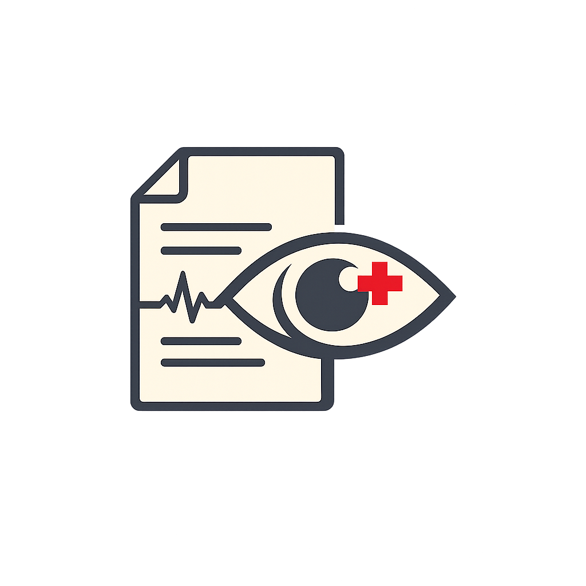
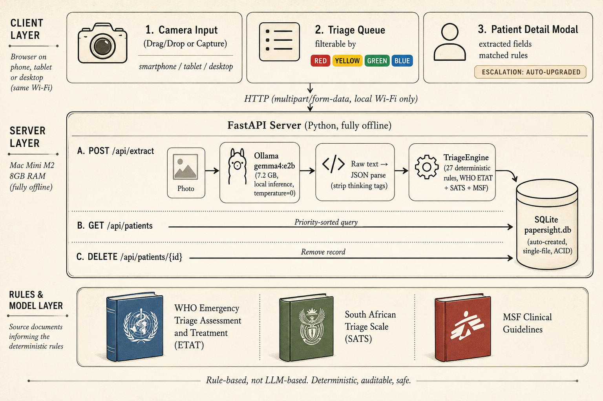

# PaperSight

<p align="center">
  
</p>

Clinical triage assistant that photographs paper intake forms, extracts patient data with a vision LLM, and assigns priority scores using deterministic clinical rules — fully offline on a Mac Mini M2 with 8GB RAM.

Powered by **Gemma 4 E2B** via [Ollama](https://ollama.com) for on-device serving.

*Gemma is a trademark of Google LLC.*

Built for the **Kaggle "Gemma 4 Good Hackathon"** (deadline: May 18, 2026).

---

## What it does

1. **Photograph** a paper patient intake form with any smartphone, tablet, or desktop browser
2. **Extract** fields (name, age, gender, chief complaint, duration, allergies, medications, referred by) using Gemma 4 E2B via Ollama
3. **Triage** the patient with rule-based scoring derived from WHO ETAT + SATS + MSF guidelines
4. **Queue** patients by priority (Red → Yellow → Green) with filtering and detail views

**Only Age and Chief Complaint are required for triage.** All other fields are optional and collected at bedside if unreadable.

---

## Architecture



---

## Requirements

- macOS (tested on Mac Mini M2, 8GB RAM)
- [Ollama](https://ollama.com) v0.21.1+
- [uv](https://github.com/astral-sh/uv) for Python package management

---

## Quick Start

### 1. Install dependencies

```bash
uv sync
```

### 2. Pull the model (one-time, ~7.2GB)

```bash
ollama pull gemma4:e2b
```

### 3. Pre-warm Ollama (avoids ~57s cold-start)

```bash
ollama run gemma4:e2b "say ready"
```

### 4. Start the server

```bash
PYTHONPATH=src uv run uvicorn papersight.main:app --host 0.0.0.0 --port 8000
```

> **Note:** `PYTHONPATH=src` is currently required due to a module resolution issue with the `papersight-server` console script. Use `0.0.0.0` (not `127.0.0.1`) so other devices on the same Wi-Fi network can reach the server.

### 5. Open in browser

- **On this Mac:** `http://127.0.0.1:8000`
- **On phone / tablet (same Wi-Fi):** find your Mac's local IP with `ipconfig getifaddr en0`, then open `http://<YOUR_IP>:8000`

---

## API Endpoints

| Method | Endpoint | Description |
|--------|----------|-------------|
| `GET`  | `/` | Serve frontend |
| `POST` | `/api/extract` | Upload photo → extract + triage |
| `GET`  | `/api/patients` | List all patients (priority sorted) |
| `DELETE` | `/api/patients/{id}` | Remove a patient |

---

## Caveats & Limitations

PaperSight is designed as **clinical decision-support**, not a replacement for trained clinical judgment. A nurse or doctor must always verify the triage and examine the patient.

### Intentionally deterministic
Triage is rule-based (WHO ETAT + SATS + MSF), not LLM-based. This makes scoring auditable and reproducible, but it also means the system cannot reason about novel presentations, atypical symptoms, or context that a clinician would recognize.

### Extraction is brittle
The vision model reads photographed paper forms. Output quality depends on handwriting, lighting, blur, and rotation. We normalize hyphenated compounds (`chest-pain` → `chest pain`) before keyword matching, but we do not perform full NLP (no stemming, no synonym expansion). If a field is unreadable, it is marked `"unreadable"` and collected at bedside.

### No vital signs
Triage is symptom-based only. Blood pressure, SpO₂, pulse, and temperature are not captured. A patient triaged as Green can still be deteriorating silently.

### Offline constraints
No cloud connectivity means no model updates, no cross-device synchronization, and no remote backup. The Mac Mini is a single point of failure. If it loses power, the queue is unavailable until it restarts.

### Hardware ceiling
Target hardware is a Mac Mini M2 with 8GB RAM. Image size is capped at 10 MB to avoid OOM. Context window is limited to 4,096 tokens. There is no batch processing.

---

## License

Apache 2.0
